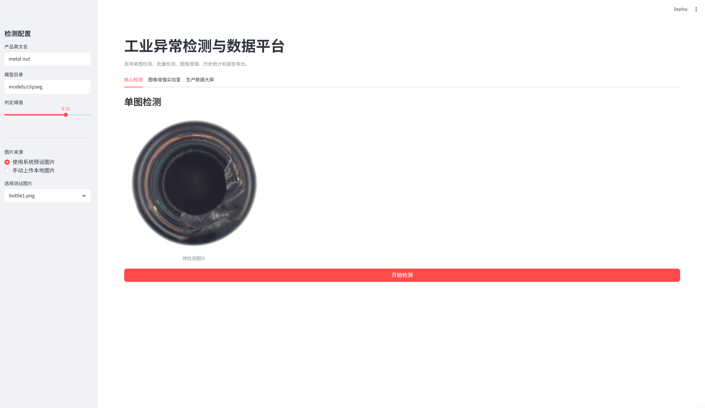
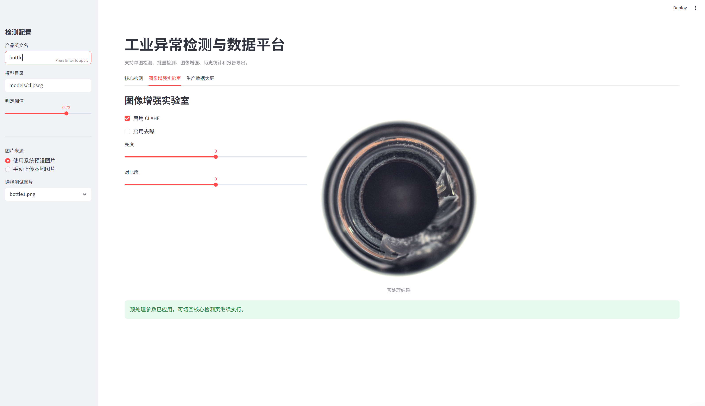
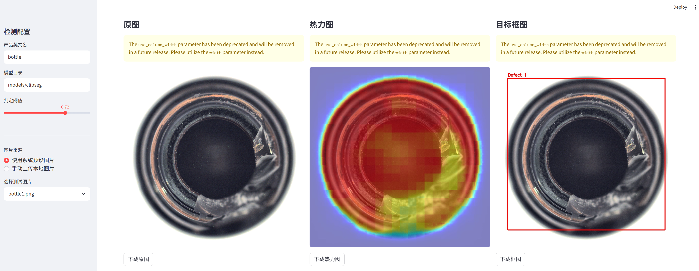
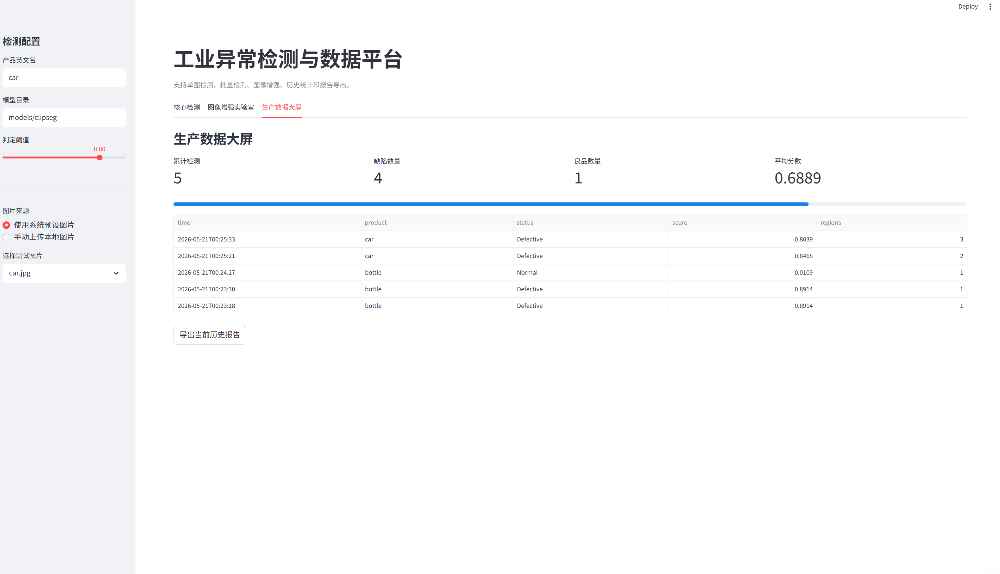

# 工业异常检测平台 (Industrial Anomaly Detection Platform)

## 📖 项目简介

**工业异常检测平台** 是一个基于多模态模型的缺陷检测系统。它利用先进的多模态模型，通过自然语言提示词（如“划痕”“裂纹”）即可直接检测工业产品图像中的异常区域，**无需针对特定产品进行训练**。系统支持完全离线运行，保障工业数据安全，并提供直观的 Web 界面，支持结果可视化、历史统计、批量检测与一键下载。

🎯 适用于快速验证、小批量多品种产品质检，以及需要保护数据隐私的工业场景

## ✨ 功能特性

- 🔌 完全离线：模型本地加载，无需联网，保障生产数据不外泄。
- 🖼️ 多种输入：支持从本地文件夹选择预设图片或手动上传图片。
- 🧪 图像增强：支持 CLAHE、去噪、亮度和对比度调节。
- 📊 结果可视化：
  - 原始图像
  - 缺陷热力图（红色区域表示异常概率高）
  - 缺陷边界框（自动筛选高置信度区域并绘制红框）
- ⬇️ 一键下载：所有结果图均可直接下载，便于存档与报告。
- 📦 批量检测：支持对文件夹内图片进行批量推理。
- 📝 报告导出：支持导出 JSON、CSV、HTML 报告。
- 🌐 交互式界面：基于 Streamlit 构建，操作简单，响应迅速。
- 🧩 可引用接口：提供 `industrial_ad` Python 包和 CLI 工具，便于第三方程序集成。

## 🛠️ 技术栈

- 前端/框架：Streamlit
- 深度学习模型：Hugging Face Transformers
- 后端推理：PyTorch, OpenCV, PIL, NumPy, Pandas
- 工程化：Python Package, CLI, JSON/CSV/HTML 报告导出

## 📁 项目结构

```text
industrial-ad-web/
├── app.py                     # 主程序（Web 界面）
├── main.py                    # CLI 入口
├── download_model.py          # 模型下载脚本（首次运行需要）
├── industrial_ad/             # 可被第三方引用的核心包
│   ├── __init__.py
│   ├── config.py              # 配置与参数管理
│   ├── types.py               # 数据结构定义
│   ├── detector.py            # 核心推理逻辑
│   ├── batch.py               # 批量检测
│   ├── reports.py             # 报告导出
│   ├── storage.py             # 历史记录存储
│   ├── metrics.py             # 评估指标
│   └── cli.py                 # 命令行工具
├── core/                      # 旧版辅助模块
│   └── image_enhancer.py      # 图像增强功能
├── models/                    # 存放下载的模型文件
│   └── clipseg/               # 模型文件目录
├── sample_images/             # 示例图片文件夹（用户可自行添加）
├── outputs/                   # 检测输出与报告
├── records/                   # 检测历史记录
└── readme.md                  # 本文件
```

## 🚀 快速开始

```bash
pip install -r requirements.txt
```

**下载模型**（仅首次需要）

```bash
python download_model.py
```

**准备示例图片（可选）**

将您的测试图片放入 `sample_images/` 文件夹，支持 `.jpg`、`.jpeg`、`.png`、`.bmp`、`.webp` 格式。

**启动 Web 应用**

```bash
streamlit run app.py
```

**启动命令行工具**

```bash
python main.py history
```

## 📝 使用说明

1. 在侧边栏配置产品名称

- 输入产品的英文名称（例如：`bottle`、`metal nut`、`leather`、`pill`），这将作为文本提示词的一部分。

2. 选择图片来源

- **使用系统预设图片**：从 `sample_images/` 下拉列表中选择一张测试图。
- **手动上传本地图片**：点击上传按钮选择您自己的图片。

3. 执行检测

- 确认图片预览无误后，点击“开始检测”按钮。

4. 查看与下载结果

- 系统将展示三列对比视图：原始图像、缺陷热力图、缺陷边界框。
- 每张结果图下方均有“下载”按钮，点击即可保存为 JPEG 文件。

5. 查看生产数据大屏

- 可查看累计检测数量、缺陷数量、良品数量、平均分数和最近检测记录。

## ⚙️ 自定义提示词

在 `industrial_ad/config.py` 的 `DetectorConfig` 中，可以修改 `defect_words` 或 `prompt_template`，添加或删除您关心的缺陷类型。例如：

```python
from industrial_ad.config import DetectorConfig

config = DetectorConfig(
    defect_words=["scratch", "crack", "stain", "dent", "corrosion"],
    prompt_template="{defect} on {product}"
)
```

也可以在调用检测器时传入额外提示词：

```python
from industrial_ad import AnomalyDetector

detector = AnomalyDetector(model_path="models/clipseg")
result = detector.detect_path(
    "sample_images/bottle1.png",
    product_name="bottle",
    extra_defect_words=["burn", "smudge"]
)
```

## 🧩 图片展示






## 📌 注意事项

- 首次运行前必须执行 `python download_model.py` 下载模型，否则应用会报错。
- 项目支持离线运行，模型文件一旦下载完毕，即可在无网络环境下使用。
- 当前模型文件较大，请确保磁盘空间和网络稳定。
- 如果需要第三方程序调用，优先使用 `industrial_ad` 包或 `main.py` 命令行入口。

## 👌 新增文件
*industrial_ad/eval.py*
- 它会：读取 CSV 或 JSON，从expected / predicted 列直接算；如果没有 predicted，就用 score + threshold 算
- 输出 accuracy / precision / recall / F1
- 可选把结果另存成 JSON
